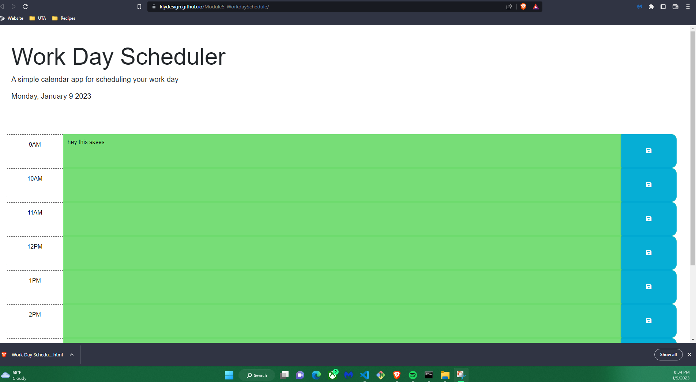

# Module5-WorkdaySchedule

Making a simple daily planner that has persistant data.
I used day js to get the time and date
I minipulated the time to be 24hours and the colors should be the same as the example I am very happy with this one 

when the hour has passed it is grey
current hour is red
future time is green

